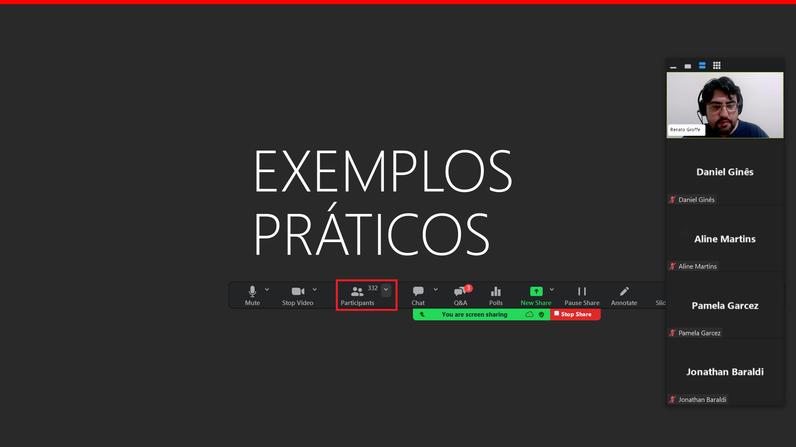
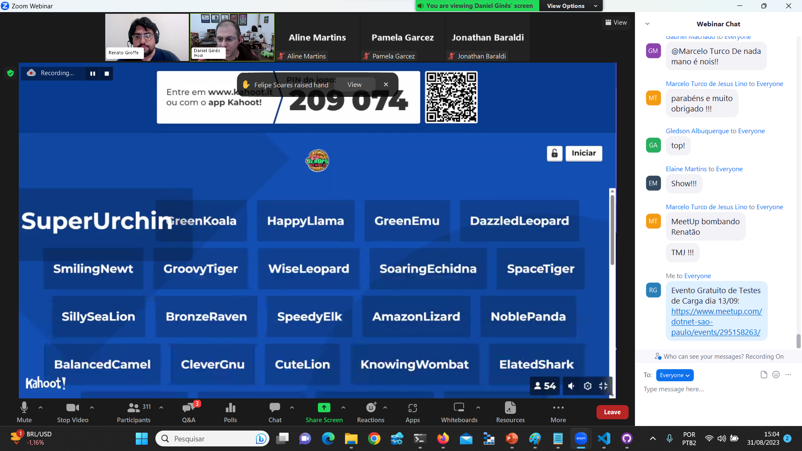
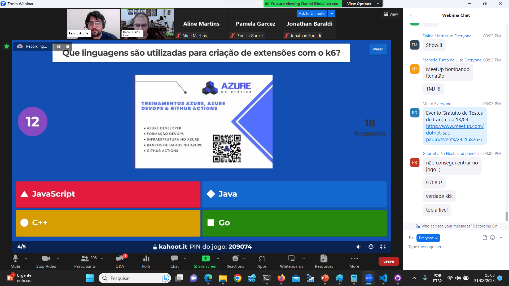
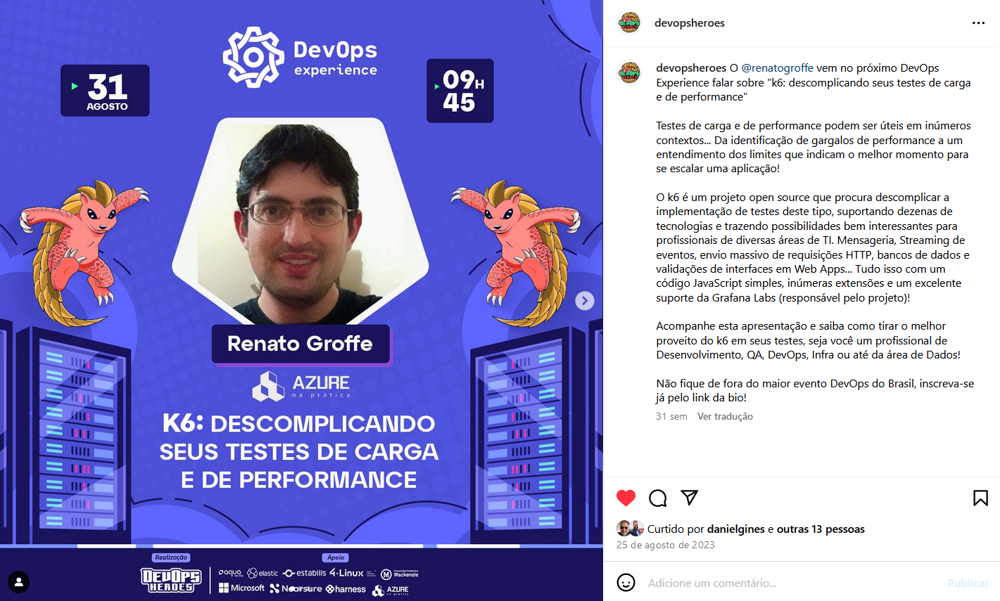

# LoadTests-k6_DevOpsExperience-Ago2023
Conteúdos sobre testes de carga com k6 relativos à minha apresentação durante a edição de Agosto-2023 do DevOps Experience.

---

Exemplo de implementação de testes de carga (API REST protegida por JWT) em JavaScript para execução com a ferramenta k6, incluindo a geração de relatórios com os resultados através do projeto k6-reporter e exportação também para JMeter (arquivo .xml). Este repositório também inclui um Pipeline do Azure DevOps.

A API REST foi disponibilizada como uma **imagem pública** no **Docker Hub**:

```bash
docker pull renatogroffe/apicontagem-dotnet7-jwt-simulacaofalhas:1
```

---

Título da Apresentação: **k6: descomplicando seus testes de carga e de performance**

Data: **31/08/2023 (quinta-feira)**

Tipo do evento: **Online**

Ferramenta de transmissão: **Zoom**

Tecnologias utilizadas: **k6, JavaScript, JWT, .NET 7, ASP.NET Core, Linux, Azure DevOps, Azure Pipelines, Azure Repos**

Número de participantes: **332 pessoas (pico de audiência ao longo da live)**

Link do evento: [**Instagram**](https://www.instagram.com/p/CwYdqLkrBLb/?img_index=1)

Deixo aqui meus agradecimentos ao **Daniel Ginês** e à **Aline Martins** por todo o apoio para que eu partipasse como palestrante de mais uma edição do **DevOps Experience**.

---







